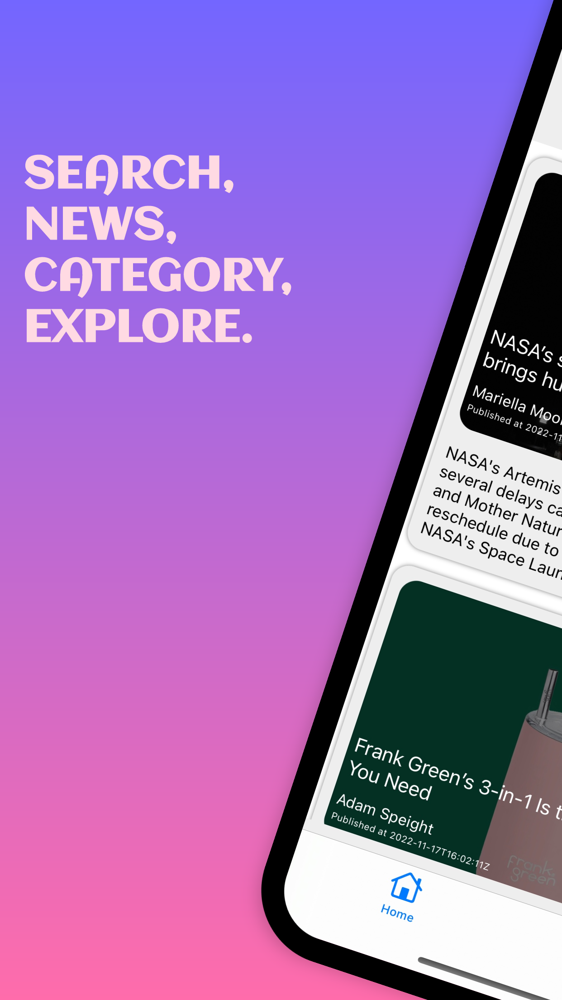
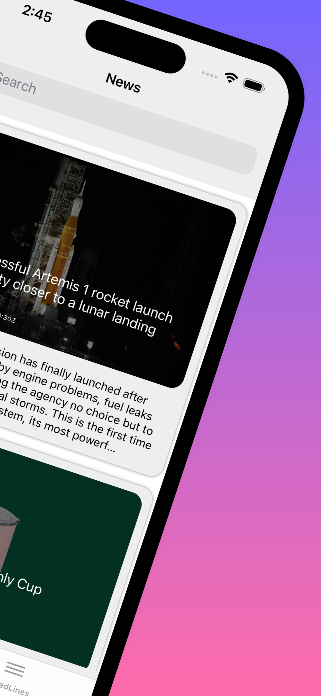
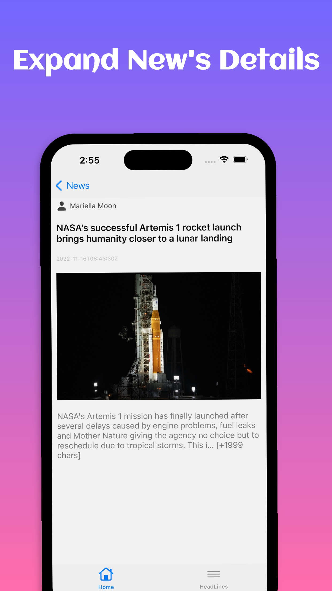
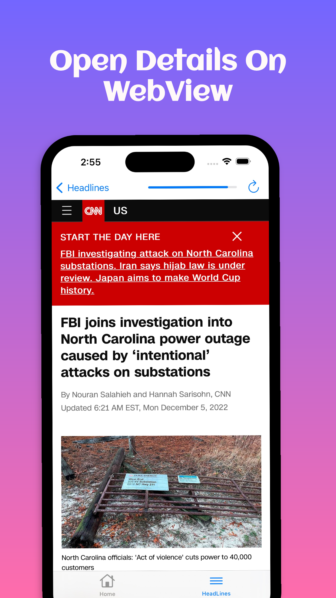

# UF-News-iOS
This is an iOS project that Get news from the News Api

 

 

## Features
- [x] Usage Of News Api
- [x] Usage of MVC design pattern
- [x] Usage of Moya
- [x] Usage of NVActivityIndicatorView
- [x] Usage of SDWebImage
- [x] Usage of WebKit

## Requirements
- Swift 5+
- Xcode 12+
- CocoaPods
